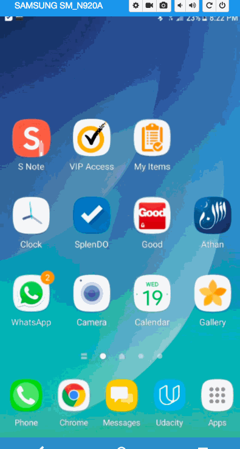

Pre-work - My Items

My Items is an android app that allows building a todo list and basic todo items management functionality including adding new items, editing and deleting an existing item.

Submitted by: Hina Khan

Time spent: 25 hours spent in total

## User Stories

The following functionality is completed:

[Y] User can successfully add and remove items from the todo list 
[Y] User can tap a todo item in the list and bring up an edit screen for the todo item and then have any changes to the text reflected in the todo list.
[Y] User can persist todo items and retrieve them properly on app restart

The following additional features are implemented:

* Persist the todo items [into SQLite]
* Improve style of the todo items in the list used a custom adapter using Recycler view
* Use a DialogFragment instead of new Activity for editing items
* Add support for selecting the priority of each todo item 
* Tweak the style improving the UI / UX, play with colors, images or backgrounds, use different colors and images across the layput
* Use splash screen
* User can add any number of items and user can scroll it.Also user can delete any time in the list, 

## Video Walkthrough 

Here's a walkthrough of implemented user stories:

GIF created with [LiceCap](http://www.cockos.com/licecap/).

## License

    Copyright [yyyy] [name of copyright owner]

    Licensed under the Apache License, Version 2.0 (the "License");
    you may not use this file except in compliance with the License.
    You may obtain a copy of the License at

        http://www.apache.org/licenses/LICENSE-2.0

    Unless required by applicable law or agreed to in writing, software
    distributed under the License is distributed on an "AS IS" BASIS,
    WITHOUT WARRANTIES OR CONDITIONS OF ANY KIND, either express or implied.
    See the License for the specific language governing permissions and
    limitations under the License.
